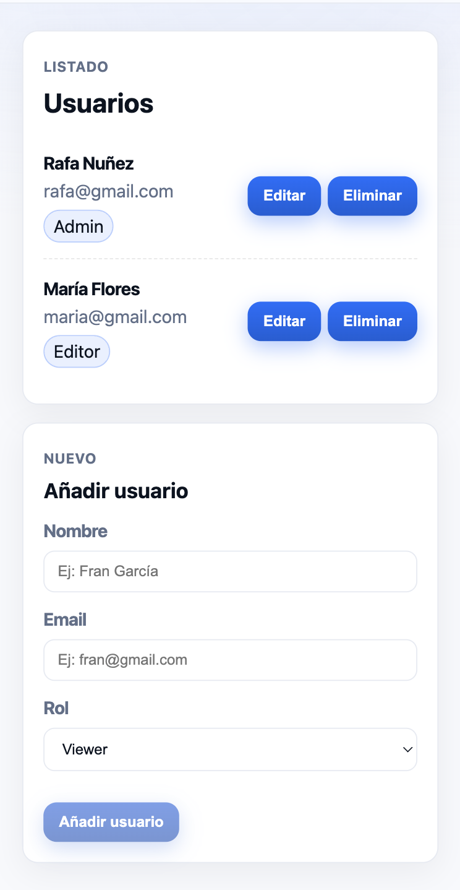
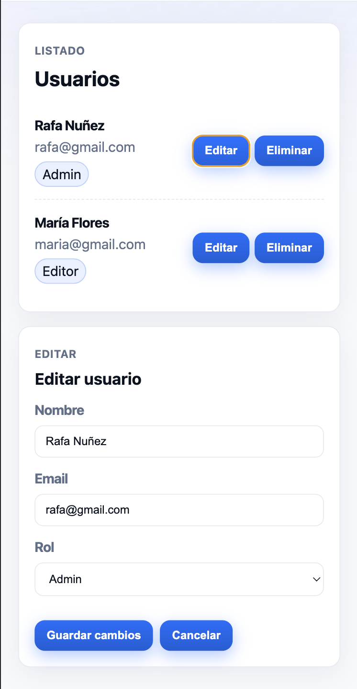

# Prueba técnica – Gestión de usuarios

## 🎯 Objetivo
Desarrollar una funcionalidad de **gestión de usuarios** dentro de una aplicación Angular v20.

El objetivo es implementar una solución funcional, clara y bien estructurada.  
No existe una única forma correcta de resolver la prueba.

  

  

---

## 🧩 Funcionalidad – Gestión de usuarios

Implementar una vista que permita **gestionar un listado de usuarios**.

### Requisitos funcionales

La vista debe permitir:

- Mostrar un listado de usuarios.
- Cada usuario debe contar, como mínimo, con la siguiente información:
  - Identificador
  - Nombre
  - Dirección de correo electrónico
  - Rol

- Incorporar un formulario para **añadir nuevos usuarios** al listado.
  - El formulario debe validar los datos introducidos.
  - Al añadir un usuario:
    - El usuario debe incorporarse al listado.
    - El formulario debe reiniciarse.

- Permitir **editar un usuario existente**.
  - Al editar un usuario:
    - Debe ser posible modificar sus datos.
    - Los cambios deben reflejarse en el listado.

- Permitir **eliminar un usuario del listado**.

Los datos pueden gestionarse en memoria, no siendo necesario ningún tipo de persistencia externa.

---

## 🧪 Testing

Añadir al menos una prueba unitaria relacionada con la funcionalidad desarrollada.

---

## 📝 Consideraciones

- La funcionalidad debe ser **usable y funcional**.
- Se valorará una solución clara, mantenible y coherente.
- Se espera poder explicar las decisiones técnicas tomadas.

---

## ⏱️ Tiempo orientativo
Entre **1 y 2 horas**.
